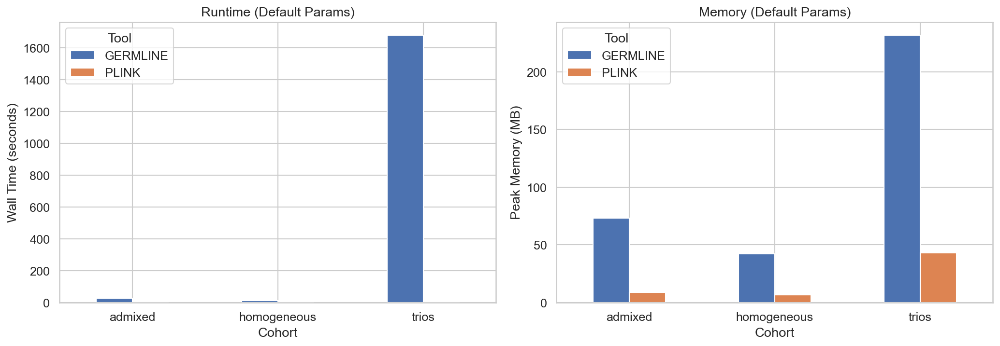
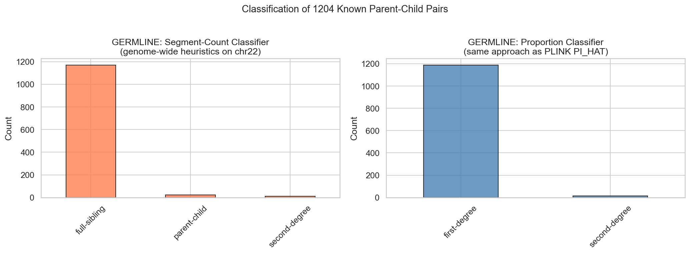
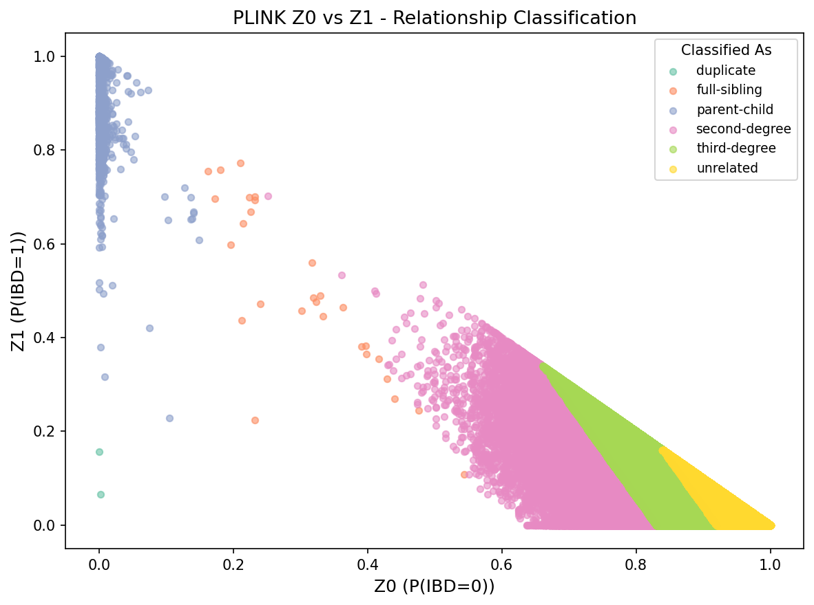

# Benchmarking PLINK and GERMLINE for IBD-Based Relative Finding

**CSE 284 - Adrian Ong (A69033975)**

## Overview

This project benchmarks two widely-used Identity by Descent (IBD) detection tools - **PLINK** (`--genome`) and **GERMLINE** - for identifying genetic relatives in diverse human populations.

I used the [1000 Genomes Project 30x high-coverage dataset](https://www.internationalgenome.org/data-portal/data-collection/30x-grch38) (3,202 samples including 602 confirmed parent-child trios) to evaluate:

- IBD detection accuracy against 1,204 known parent-child relationships
- Computational performance (runtime, peak memory) across cohort sizes
- Parameter sensitivity (minimum segment length, mismatch tolerance, PI_HAT thresholds)
- Population structure effects comparing admixed vs. homogeneous cohorts

The analysis uses chromosome 22. PLINK's method-of-moments estimator works on any subset of SNPs, and GERMLINE's segment detection is per-chromosome anyway, so chr22 is a reasonable testbed for both tools.

## Key Findings

**PLINK** is extremely fast (< 1 second for most cohorts) and classifies parent-child relationships with near-perfect accuracy on the trios cohort (precision=0.980, recall=1.0, F1=0.990). It only outputs summary IBD statistics (PI_HAT, Z0/Z1/Z2) -- no segment-level information.

**GERMLINE** detects IBD segments with full position and length information. Both tools achieve comparable accuracy when thresholds are calibrated appropriately, but GERMLINE's built-in thresholds assume whole-genome input and fail on single-chromosome data (recall=1.9%, F1=0.037). Using proportion-based thresholds instead (total shared IBD as a fraction of chromosome length) recovers strong accuracy (F1=0.966). This is a useful finding -- anyone running GERMLINE on a subset of chromosomes needs to adjust their classification thresholds accordingly. GERMLINE is also substantially slower, around 28 minutes for the 1,793-sample trios cohort vs. under 1 second for PLINK.

**Runtime comparison (default parameters):**

| Cohort | N Samples | PLINK | GERMLINE | Speedup |
|--------|-----------|-------|----------|---------|
| Admixed | 504 | 0.09 sec | 27 sec | ~300x |
| Homogeneous | 297 | 0.07 sec | 12 sec | ~170x |
| Trios | 1,793 | 0.90 sec | 1,677 sec | ~1,860x |



**Accuracy on known parent-child pairs (trios cohort):**

| Tool | Precision | Recall | F1 |
|------|-----------|--------|----|
| PLINK (Z0/Z1/Z2 thresholds) | 0.980 | 1.000 | 0.990 |
| GERMLINE (proportion-based, threshold=0.40) | 0.946 | 0.988 | 0.966 |
| GERMLINE (default segment-count thresholds) | 0.885 | 0.019 | 0.037 |

GERMLINE's default segment-count thresholds (designed for whole-genome data) misclassify nearly all parent-child pairs as siblings on single-chromosome data. Switching to proportion-based thresholds recovers near-perfect accuracy:



PLINK's Z0/Z1 scatter plot shows clean separation of relationship classes on the trios cohort:



## Dependencies

- **Python 3.10+**
- **bcftools** (`brew install bcftools` or conda)
- **C++ compiler** (for compiling GERMLINE from source)
- ~500 MB disk space for chr22 data

Python packages (installed via requirements.txt):
- pandas, numpy, matplotlib, seaborn, networkx

## Installation

```bash
# clone the repo
git clone https://github.com/Adist319/cse284-ibd-benchmark.git
cd cse284-ibd-benchmark

# set up Python environment
python3 -m venv .venv
source .venv/bin/activate
pip install -r requirements.txt

# download PLINK binaries (macOS ARM example)
mkdir -p tools
cd tools
curl -sL "https://s3.amazonaws.com/plink1-assets/plink_mac_20231018.zip" -o plink19.zip
unzip plink19.zip -d plink19
curl -sL "https://s3.amazonaws.com/plink2-assets/alpha6/plink2_mac_arm64_20250116.zip" -o plink2.zip
unzip plink2.zip -d plink2
cd ..

# compile GERMLINE from source
git clone https://github.com/gusevlab/germline.git tools/germline
cd tools/germline && make all; cd ../..
```

For Linux, replace the macOS PLINK URLs with the appropriate Linux builds from [plink1.9](https://www.cog-genomics.org/plink/) and [plink2](https://www.cog-genomics.org/plink/2.0/).

## Running the Full Pipeline

```bash
# download data, preprocess, run all analyses
bash run_all.sh
```

Or run individual steps (all commands assume you're in the project root):

```bash
bash scripts/preprocessing/download_data.sh   # download chr22 VCF + pedigree
bash scripts/preprocessing/preprocess.sh       # filter, LD-prune, split cohorts
bash scripts/analysis/run_plink_ibd.sh         # PLINK IBD + parameter sweep
bash scripts/analysis/run_germline_ibd.sh      # GERMLINE IBD + parameter sweep
python scripts/analysis/classify_plink_relationships.py --cohorts trios
python scripts/analysis/classify_germline_relationships.py \
    --match-files trios:results/germline/trios_default.match \
    --known data/processed/known_relationships.tsv \
    --output-dir results/germline
python scripts/analysis/compare_tools.py \
    --cohort trios \
    --plink-genome results/plink/trios_default.genome \
    --germline-match results/germline/trios_default.match \
    --known-rels data/processed/known_relationships.tsv
```

Note: the GERMLINE VCF-to-PED conversion for the trios cohort (1,793 samples) takes roughly 2 hours. The admixed and homogeneous cohorts take about 5-10 minutes each.

## Quick Test Example

To verify the pipeline works, run the full pipeline with `bash run_all.sh`. For the fastest result, the homogeneous cohort (~297 samples) finishes in under 10 minutes total.

If you already have results from a prior run, you can test the classification scripts directly (all commands must be run from the project root):

```bash
source .venv/bin/activate

# classify PLINK relationships for the trios cohort
python scripts/analysis/classify_plink_relationships.py \
    --cohorts trios \
    --suffix default

# view the classified pairs (each row is a pair with predicted relationship)
head -5 results/plink/trios_classified.tsv
```

For GERMLINE on the same cohort:

```bash
python scripts/analysis/classify_germline_relationships.py \
    --match-files trios:results/germline/trios_default.match \
    --known data/processed/known_relationships.tsv \
    --output-dir results/germline/

# view per-pair IBD summary (total shared cM, segment count, classification)
head -10 results/germline/trios_pairs_summary.tsv
```

Note: the `run_plink_ibd.sh` and `run_germline_ibd.sh` scripts run all three cohorts together and rewrite the benchmarks file, so run them as part of the full pipeline rather than individually.

## Dataset

**1000 Genomes Project 30x High-Coverage** (Byrska-Bishop et al., Cell 2022):
- 3,202 samples from 26 populations
- 602 confirmed parent-child trios (1,204 known relationships)
- Phased VCFs on GRCh38, chr22 used here

### Population Cohorts

| Cohort | Populations | N Samples | N SNPs (chr22) | N LD-pruned SNPs |
|--------|------------|-----------|----------------|------------------|
| Admixed | PUR, CLM, MXL, PEL, ASW, ACB | 504 | ~104K | ~9K |
| Homogeneous | CEU, GBR, TSI | 297 | ~90K | ~7K |
| Trios | all samples with known relatives | 1,793 | ~106K | ~9.5K |

## Methods

### PLINK IBD (`--genome`)

Method-of-moments estimator of pairwise IBD proportions. Outputs Z0, Z1, Z2 (probability of sharing 0, 1, or 2 alleles IBD) and PI_HAT (weighted sum). Requires LD-pruned input. Runs in O(n^2 * m) time but the constant is very small.

### GERMLINE

Seed-and-extend hashing algorithm for detecting shared IBD segments. Outputs segment coordinates, genetic length in cM, and mismatch count. Requires phased input - do not run through PLINK first since that strips phase information. Roughly O(n) per chromosome via hashing, but slower in practice on large cohorts.

### Relationship Classification

**PLINK** - thresholds on PI_HAT + Z scores:

| Relationship | Criteria |
|---|---|
| Parent-child | PI_HAT > 0.4, Z0 < 0.15 |
| Full sibling | PI_HAT > 0.35, Z2 > 0.1 |
| Second-degree | 0.17 < PI_HAT < 0.4 |
| Third-degree | 0.08 < PI_HAT < 0.17 |

**GERMLINE** - for chr22 specifically, use proportion-based thresholds (total IBD / 55 cM expected for parent-child on chr22). Fixed segment-length thresholds designed for whole-genome data will not work on a single chromosome.

## Troubleshooting

**`bcftools: command not found`**

```bash
# macOS
brew install bcftools

# conda
conda install -c bioconda bcftools
```

**GERMLINE fails to compile (`make all` errors)**

Make sure you have a C++ compiler installed. On macOS, run `xcode-select --install` if you haven't already. If you get linker errors, try:
```bash
cd tools/germline
make clean
make all
```

**`download_data.sh` fails with permission or network errors**

The 1000 Genomes FTP server can be slow. If `curl` times out, re-run the script -- it skips files that already exist. The chr22 VCF is ~300 MB.

**GERMLINE VCF-to-PED conversion is very slow**

This is expected for the trios cohort (1,793 samples x ~106K variants). It takes roughly 2 hours. The admixed and homogeneous cohorts finish in 5-10 minutes. If you just want to verify the pipeline works, run the homogeneous cohort first (smallest).

**Python import errors**

Make sure you activated the virtual environment and installed dependencies:
```bash
source .venv/bin/activate
pip install -r requirements.txt
```

## References

- Byrska-Bishop, M., et al. (2022). High-coverage whole-genome sequencing of the expanded 1000 Genomes Project cohort including 602 trios. *Cell*, 185(18), 3426-3440.
- Purcell, S., et al. (2007). PLINK: a tool set for whole-genome association and population-based linkage analyses. *AJHG*, 81(3), 559-575.
- Gusev, A., et al. (2009). Whole population, genome-wide mapping of hidden relatedness. *Genome Research*, 19(2), 318-326.
- Manichaikul, A., et al. (2010). Robust relationship inference in genome-wide association studies. *Bioinformatics*, 26(22), 2867-2873.
